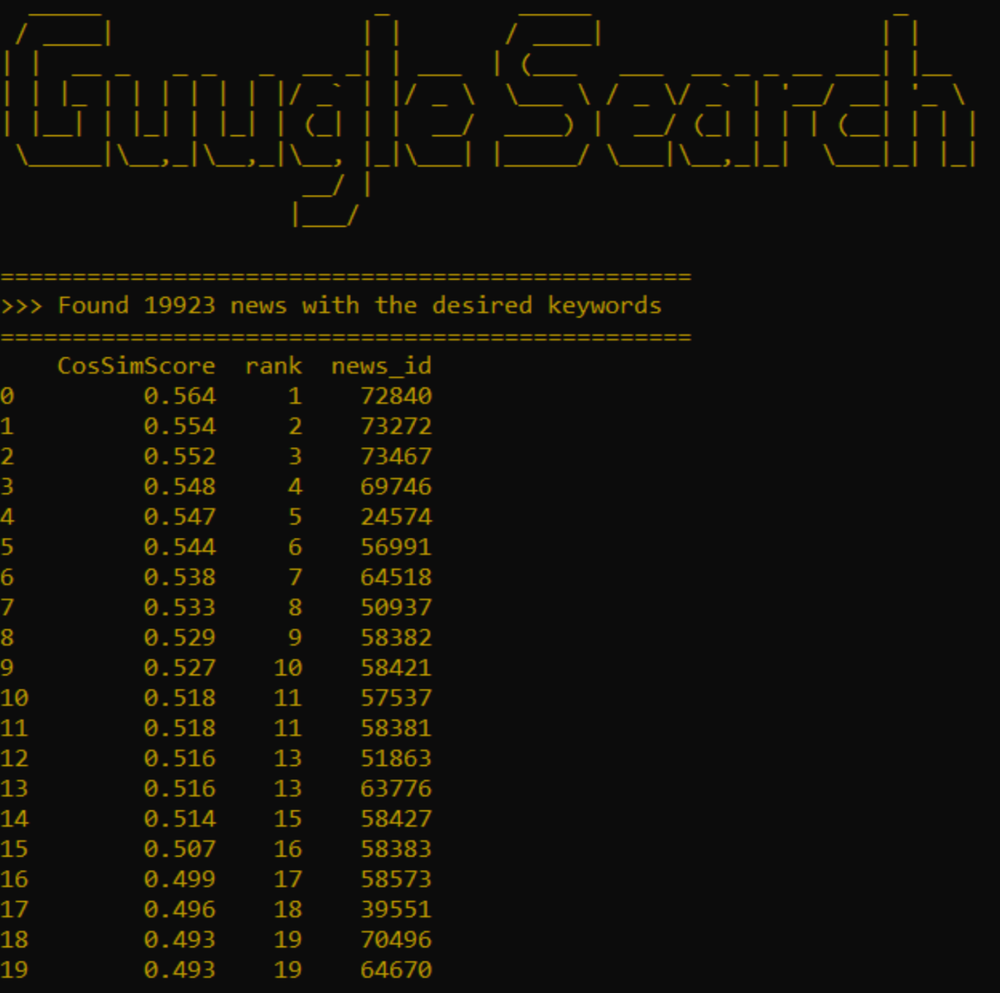

# NLP-Query-Search
NLP Challenge where the most relevant articles from a set of 50 000 available documents were returned to the used according to a specified simple or complex query. To find the most relevant articles, tasks such as tokenization, normalization, lemmatization and stemming were applied. The arguments were also vectorized into a TF-IDF Matrix and the similarity between the query and the articles was obtained using cosine similarity. It is important to notice that to filter the articles according to the query I used an inverted index.

